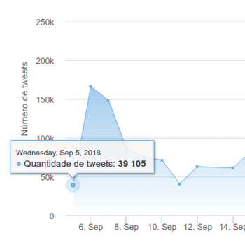
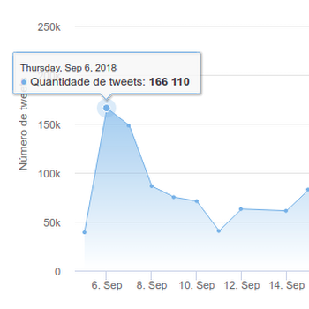
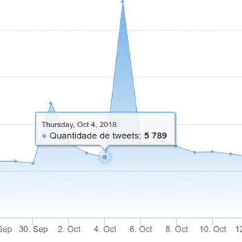
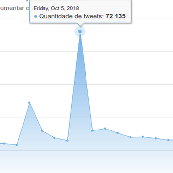
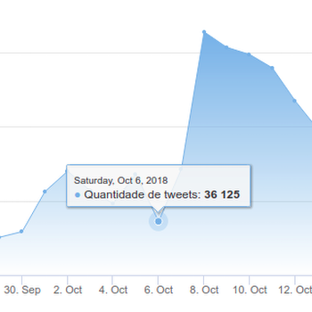
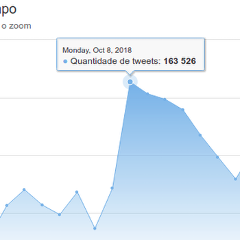
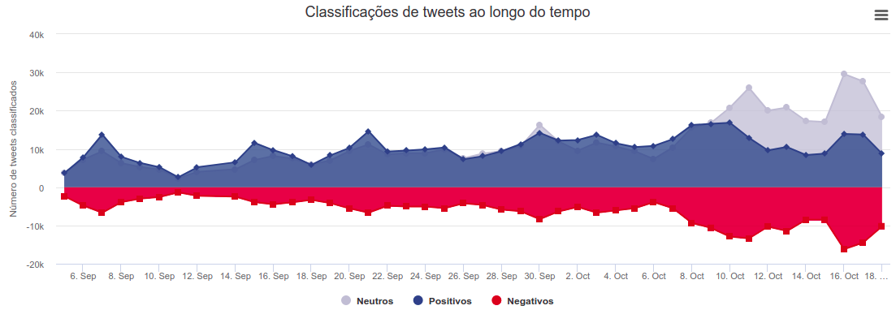
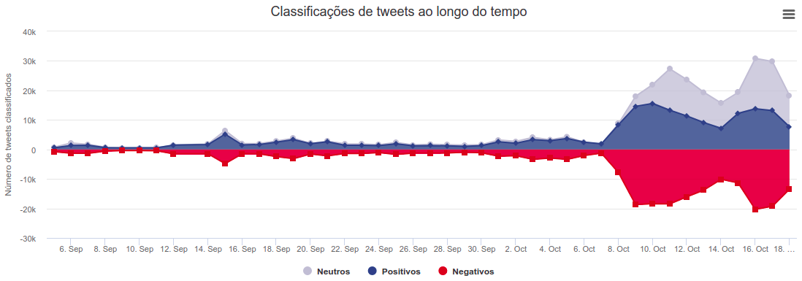

# Twitter Sentiment Analysis

## Análise de Sentimentos Utilizando o Twitter nas Eleições Brasileiras de 2018.

### Website: https://diegowendel.github.io/sentiment-analysis

Projeto realizado no ano de 2018, aplicando inteligência artificial para classificação de sentimentos presentes nos textos compartilhados em postagens do Twitter. Todas postagens com relação a algum dos candidatos presidenciáveis nas eleições brasileiras de 2018 foi coletada no período de 05/09/2018 até 28/10/2018.

---

## Contagem de Tweets

A contagem de postagens sobre os candidatos possibilitou analisar eventos únicos que promoveram alguma repercussão no Twitter. A seguir são mostrados alguns picos (aumento repentino), no número de tweets de alguns candidatos.

### Pico no gráfico do candidato Jair Bolsonaro

No dia 6 de setembro de 2018, o candidato [Bolsonaro leva uma facada em atentado durante campanha em Juiz de Fora](https://veja.abril.com.br/politica/bolsonaro-leva-facada-em-atentado-durante-campanha-em-juiz-de-fora/). A repercussão desse acontecimento pode ser notada no salto da quantidade de tweets mencionando o candidato, de *39.105* no dia 5 para *166.110* no dia 6 de setembro.

Número de tweets Bolsonaro - 05 de setembro             |  Número de tweets Bolsonaro - 06 de setembro
:-------------------------:|:-------------------------:
  |  

### Pico no gráfico do candidato Guilherme Boulos

Debates entre os candidatos presidenciáveis geraram repercussões notáveis na popularidade dos candidatos no Twitter, como no caso de Guilherme Boulos, que teve um aumento de *5.789* tweets no dia 04/08 para *72.135* tweets no dia 05/08. O debate que ocorreu nessa data foi o [debate promovido pela rede Globo](https://g1.globo.com/politica/eleicoes/2018/noticia/2018/10/05/veja-a-integra-do-debate-na-globo.ghtml), que teve início no fim da noite do dia 4 de outubro e finalizou na madrugada do dia 5 de outubro. Fato que solidifica os resultados obtidos e mostrados nas figuras. Os outros participantes do debate também tiveram picos em seus gráficos, mas o mais percetível obtido foi o de Boulos.

Número de tweets Boulos - 04 de outubro             |  Número de tweets Boulos - 05 de outubro
:-------------------------:|:-------------------------:
  |  

### Pico no gráfico do candidato Fernando Haddad

Na figura 9 fica nítido um comportamento interessante, Fernando Haddad cresce
em popularidade após o dia do [primeiro turno das eleições](https://g1.globo.com/politica/eleicoes/2018/noticia/eleicoes-2018-datas.ghtml), fato justificado com sua concorrência ao segundo turno das votações.

<table style="width:100%;">
    <tbody>
        <tr>
            <td align="center">
                
            </td>
            <td align="center">
                
            </td>
        </tr>
    </tbody>
</table>

<table>
    <thead>
        <th>Posição</th>
        <th>Candidato</th>
        <th>Votos</th>
        <th>Tweets</th>
    </thead>
    <tbody>
        <tr>
            <td><strong>1</strong></td>
            <td><strong>Jair Bolsonaro</strong></td>
            <td><strong>49.277.010</strong></td>
            <td><strong>5.417.003</strong></td>
        </tr>
        <tr>
            <td><strong>2</strong></td>
            <td><strong>Fernando Haddad</strong></td>
            <td><strong>31.342.051</strong></td>
            <td><strong>2.413.000</strong></td>
        </tr>
        <tr>
            <td><strong>3</strong></td>
            <td><strong>Ciro Gomes</strong></td>
            <td><strong>13.344.371</strong></td>
            <td><strong>1.800.999</strong></td>
        </tr>
        <tr>
            <td><strong>4</strong></td>
            <td><strong>Geraldo Alckmin</strong></td>
            <td><strong>5.096.350</strong></td>
            <td><strong>464.565</strong></td>
        </tr>
        <tr>
            <td>5</td>
            <td>João Amoêdo</td>
            <td>2.679.745</td>
            <td>342.847</td>
        </tr>
        <tr>
            <td>6</td>
            <td>Cabo Daciolo</td>
            <td>1.348.323</td>
            <td>296.029</td>
        </tr>
        <tr>
            <td>7</td>
            <td>Henrique Meirelles</td>
            <td>1.288.950</td>
            <td>92.049</td>
        </tr>
        <tr>
            <td>8</td>
            <td>Marina Silva</td>
            <td>1.069.578</td>
            <td>432.944</td>
        </tr>
        <tr>
            <td>9</td>
            <td>Álvaro Dias</td>
            <td>859.601</td>
            <td>76.571</td>
        </tr>
        <tr>
            <td>10</td>
            <td>Guilherme Boulos</td>
            <td>617.122</td>
            <td>348.192</td>
        </tr>
        <tr>
            <td>11</td>
            <td>Vera Lúcia</td>
            <td>55.762</td>
            <td>94.225</td>
        </tr>
        <tr>
            <td><strong>12</strong></td>
            <td><strong>José Maria Eymael</strong></td>
            <td><strong>41.710</strong></td>
            <td><strong>12.069</strong></td>
        </tr>
        <tr>
            <td><strong>13</strong></td>
            <td><strong>João Goulart</strong></td>
            <td><strong>30.176</strong></td>
            <td><strong>9.306</strong></td>
        </tr>
    </tbody>
</table>

---

## Classificação de Tweets

Classificação dos tweets relacionados ao candidato Jair Bolsonaro.

  

Classificação dos tweets relacionados ao candidato Fernando Haddad.

  

<table>
    <thead>
        <th>Posição</th>
        <th>Candidato</th>
        <th>Tweets</th>
        <th>% positivo</th>
        <th>% negativo</th>
        <th>% neutro</th>
    </thead>
    <tbody>
        <tr>
          <td>1</td>
          <td>Jair Bolsonaro</td>
          <td>1.206.870</td>
          <td>36,2</td>
          <td>22,8</td>
          <td>41</td>
        </tr>
        <tr>
          <td>2</td>
          <td>Fernando Haddad</td>
          <td>708.120</td>
          <td>36,2</td>
          <td>31,2</td>
          <td>42,7</td>
        </tr>
        <tr>
          <td>3</td>
          <td>Ciro Gomes</td>
          <td>290.344</td>
          <td>44,8</td>
          <td>20</td>
          <td>35,2</td>
        </tr>
        <tr>
          <td>4</td>
          <td>Geraldo Alckmin</td>
          <td>232.463</td>
          <td>28,5</td>
          <td>31,7</td>
          <td>39,8</td>
        </tr>
        <tr>
          <td>5</td>
          <td>João Amoêdo</td>
          <td>202.347</td>
          <td>44,9</td>
          <td>18,6</td>
          <td>36,5</td>
        </tr>
        <tr>
          <td>6</td>
          <td>Guilherme Boulos</td>
          <td>151.666</td>
          <td>30,8</td>
          <td>27,7</td>
          <td>41,5</td>
        </tr>
        <tr>
          <td>7</td>
          <td>Marina Silva</td>
          <td>96.723</td>
          <td>42,3</td>
          <td>19,4</td>
          <td>38,3</td>
        </tr>
        <tr>
          <td>8</td>
          <td>Álvaro Dias</td>
          <td>38.028</td>
          <td>32,2</td>
          <td>28,4</td>
          <td>39,4</td>
        </tr>
        <tr>
          <td>9</td>
          <td>Cabo Daciolo</td>
          <td>34.857</td>
          <td>37</td>
          <td>17,2</td>
          <td>45,8</td>
        </tr>
        <tr>
          <td>10</td>
          <td>Henrique Meirelles</td>
          <td>12.762</td>
          <td>38,2</td>
          <td>20,9</td>
          <td>40,9</td>
        </tr>
        <tr>
          <td>11</td>
          <td>José Maria Eymael</td>
          <td>917</td>
          <td>41,9</td>
          <td>14,9</td>
          <td>43,2</td>
        </tr>
        <tr>
          <td>12</td>
          <td>João Goulart</td>
          <td>705</td>
          <td>38,3</td>
          <td>20,3</td>
          <td>41,4</td>
        </tr>
        <tr>
          <td>13</td>
          <td>Vera Lúcia</td>
          <td>623</td>
          <td>33,5</td>
          <td>24,1</td>
          <td>42,4</td>
        </tr>
    </tbody>
</table>
